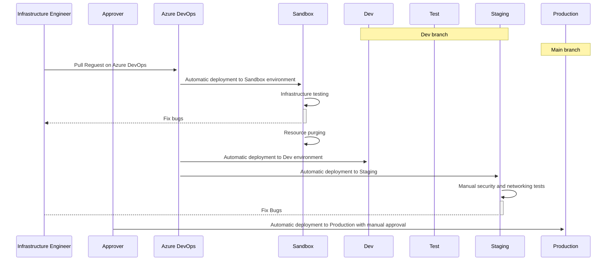

# Technical | DevOps | Infrastructure As a Code

## Introduction

TODO: Explain whch infrastructure prerequisites are needed to run your project. Explain which coding tools are going to be used to deploy your infrastrucure (Ansilbe, Terraform, Bicep, ARM, CludCode, etc.).

## Process

TODO: Explain process of developing and deploying infrastrucure code (recomended editors, recomended DevOps tools). Link pipeline documents used to explain deployment process

### Sequence diagram example
---

