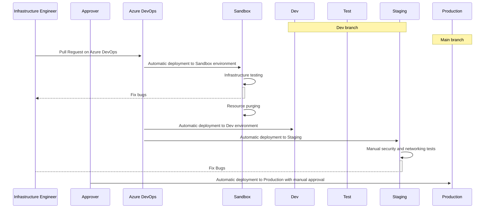

# Technical | Integrations | Integration Name | Architecture | Data flow

TODO: Show and explain data flow (sequence) that your integration is going to use/implement.

## Sequence diagram example

[Link to examples](https://github.com/mermaid-js/mermaid/blob/develop/docs/sequenceDiagram.md)